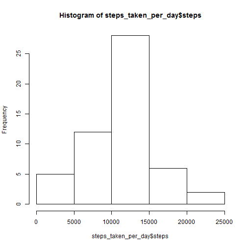

---
title: "Reproducible Research: Peer Assessment 1"
author: "Jari Kaljunen"
output: 
html_document:
keep_md: true
---

## Introduction

This is the first Peer Assignment on the Reproducible Research -course in Data Science Specialization.

The task is to create a document as .md and .html, which are to include the R code, plots and documentation
as defined in the assignment description.

This assignment makes use of data from a personal activity monitoring device. The data is given and is saved in 
a directory in the working directory (ReproducibleReseachAssignmentData). How that is done is outside of the scope
of this assignment.

## Loading and preprocessing the data


```r
x <- read.csv("ReproducibleReseachAssignmentData/activity.csv", colClasses=c("numeric","Date","integer"))
```

## What is mean total number of steps taken per day?

The missing values could be omitted for this step according instruction in the assignment.

Calculation of the total number of steps taken per day.


```r
steps_taken_per_day <- aggregate(x$steps ~ x$date, x, sum)
colnames(steps_taken_per_day) <- c("date","steps") # change the column names for clarity
```

Histogram of the total number of steps taken each day.


```r
hist(steps_taken_per_day$steps)
```

 

Calculation and reporting the mean and median of the total number of steps taken per day.s


```r
mean(steps_taken_per_day$steps)
```

```
## [1] 10766.19
```

```r
median(steps_taken_per_day$steps)
```

```
## [1] 10765
```

## What is the average daily activity pattern?

A time series plot of the 5-minute interval (x-axis) and the average number of steps taken, averaged across all days (y-axis).


```r
# calculate the aggregates by interval
steps_by_interval <- aggregate(x$steps ~ x$interval, x, mean)
colnames(steps_by_interval) <- c("interval","steps")
plot(steps_by_interval,type="l")
```

 

Which 5-minute interval, on average across all the days in the dataset, contains the maximum number of steps?


```r
steps_by_interval[steps_by_interval$steps == max(steps_by_interval$steps),'interval']
```

```
## [1] 835
```

When comparing with the plot, the interval value seem to be correct.

## Imputing missing values

Calculate and report the total number of missing values in the dataset (i.e. the total number of rows with NAs)

As it is not totally clear which columns might have missing values, that will checked.


```r
length(which(is.na(x$steps)))
```

```
## [1] 2304
```

```r
length(which(is.na(x$date)))
```

```
## [1] 0
```

```r
length(which(is.na(x$interval)))
```

```
## [1] 0
```

Only column for steps has missing values, so the number of rows with missing values is the number of rows with
missing value for steps.

```r
length(which(is.na(x$steps)))
```

```
## [1] 2304
```

Strategy for filling in all of the missing values in the datase: fill the missing number of steps with
mean of the steps for that particular interval.


```r
interval_mean <- steps_by_interval$steps / length(steps_by_interval$steps)
intervals <- unique(x$interval)

y <- x

for (n in 0:nrow(x)) {
        if (is.na(x[n,'steps'][1])) {
                y[n,'steps'] <- interval_mean[which(intervals == x[n,'interval'])]
                }
        }
```

Now histogram, median and mean with imputed values.

Calculation of the total number of steps taken per day.


```r
steps_taken_per_day <- aggregate(y$steps ~ y$date, y, sum)
colnames(steps_taken_per_day) <- c("date","steps") # change the column names for clarity
```

Histogram of the total number of steps taken each day.


```r
hist(steps_taken_per_day$steps)
```

 

Calculation and reporting the mean and median of the total number of steps taken per day.s


```r
mean(steps_taken_per_day$steps)
```

```
## [1] 9359.132
```

```r
median(steps_taken_per_day$steps)
```

```
## [1] 10395
```

The histogram, mean and median indicate lower activity when using data with imputed missing values.

## Are there differences in activity patterns between weekdays and weekends?

New factor variable in the dataset with two levels -- "weekday" and "weekend" indicating whether a given date is a weekday or weekend day.


```r
daytype <- rep("weekday",nrow(y))
daytype[as.numeric(strftime(y$date,format="%u")) > 5] <- "weekend"
daytype <- factor(daytype,labels=c("weekday","weekend"))
y <- cbind(y,daytype)
```

A panel plot containing a time series plot (i.e. type = "l") of the 5-minute interval (x-axis) and the average number of steps taken, averaged across all weekday days or weekend days (y-axis).


```r
steps_by_interval_daytype <- aggregate(y$steps, FUN=mean, by=list(y$interval,y$daytype))
colnames(steps_by_interval_daytype) <- c("interval","daytype","steps")
library(lattice)
xyplot( steps ~ interval | factor(daytype) ,  data=steps_by_interval_daytype,
        type="l", layout = c(1, 2), ylab = "Number of steps", xlab = "Interval")
```

 
